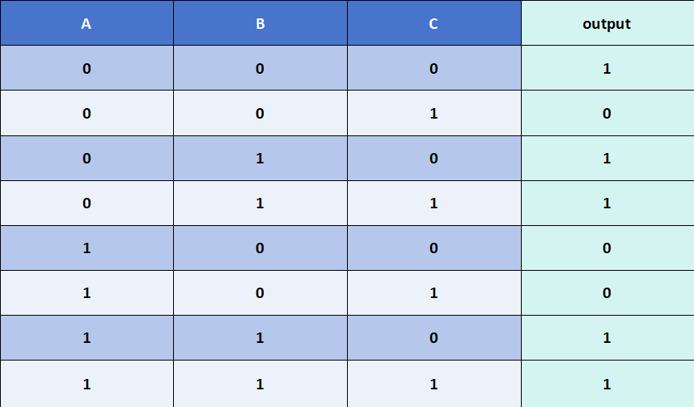
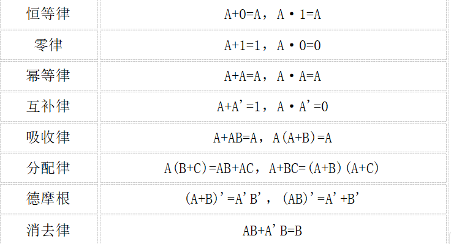

# F阶段 部分基础知识扩展
正式进入本扩展讲义之前，先明确： 本扩展旨在补充一些讲义中涉及但不够仔细描述的知识，就算不参考本扩展讲义，你仍然能很好的完成F的必做题，讲义的存在是为了让你更好地理解相关知识，但并不意味着你就能心安理得的将学习完全交给讲义，有些不清楚的知识还是建议你通过 **STFW** 来获得，这也是我们希望你能学到的最重要的技能.
 
## F3
###  真值表的转化
在F3讲义“搭建异或门”必做题中，简单提到了如何通过真值表转换为逻辑表达式的方法，理论上说只要你能写出真值表，那这个方法就能让你解决所有的电路搭建了，这里我们展开来细说一下，查看下图的真值表：

 

  

 

我们重新描述讲义中的方法：1、找到所有输出为“1”的情况，再根据输入情况，输入“1”则不变，输入“0”则取反，将输入取与，以第一行为例就是 ~A & ~B & ~C. 2、将所有这些情况取或,得到上述真值表的完整表达式:

 

Y = (~A & ~B & ~C) | (~A & B & ~C) | (~A & B & C) | (A & B & ~C) | (A & B & C)

 

事实上,你不止可以通过找"1"的情况来解决,还可以通过找"0"的情况来解决: 1、根据输入情况,“0”则不变，输入“1”则取反，将输入取或,以第二行为例就是 A | B | ~C. 2、将所有这些情况取与,得到真值表的完整表达式:

 

Y = (A | B | ~C) & (~A | B | C) & (~A | B | ~C)

 

试着检查下两个表达式是不是都能代表上述真值表,而且第二个表达式看起来是不是要简洁很多?这是因为这里输出0的情况更少,真实搭建电路时你就可以根据输出的情况来找出逻辑表达式了,总结就是 **"1多找0,0多找1"** . 
接下来相信你已经会举一反三了,哪怕4个、5个甚至更多输入你都能写出最基础的逻辑表达式,并根据表达式搭建出相应电路,多个输出也一样,因为每个输出都可以看成独立的一个真值表.现在回去看 **七段数码管** 的搭建,是不是有思路了呢?当然，讲义中的一些电路搭建也不一定要用这种“万能公式”来解决，毕竟logisim提供了不少元件供你使用，该怎么搭配它们来实现电路功能，相信聪明的你肯定能做到 
有关卡诺图化简的知识就请你 **STFW** 了,不了解它不影响你F阶段电路的搭建,但是数字逻辑的课程你迟早会学到的.
###  一些布尔计算
以下公式作为电路化简的参考，其中加法“+”表示逻辑取或，乘法“·”表示逻辑取与，单引号“ ’ ”表示逻辑取非.

 

  

 

实际上在F阶段的学习中完全不需要这些公式，但是如果你很喜欢简洁的电路，那你可以尝试是否能用这些公式将你的电路化简，而现在你可以尝试利用这些公式验证上面的两个真值表逻辑表达式是否是同一个表达式.
## F5
### 未完成
## F6
### 未完成